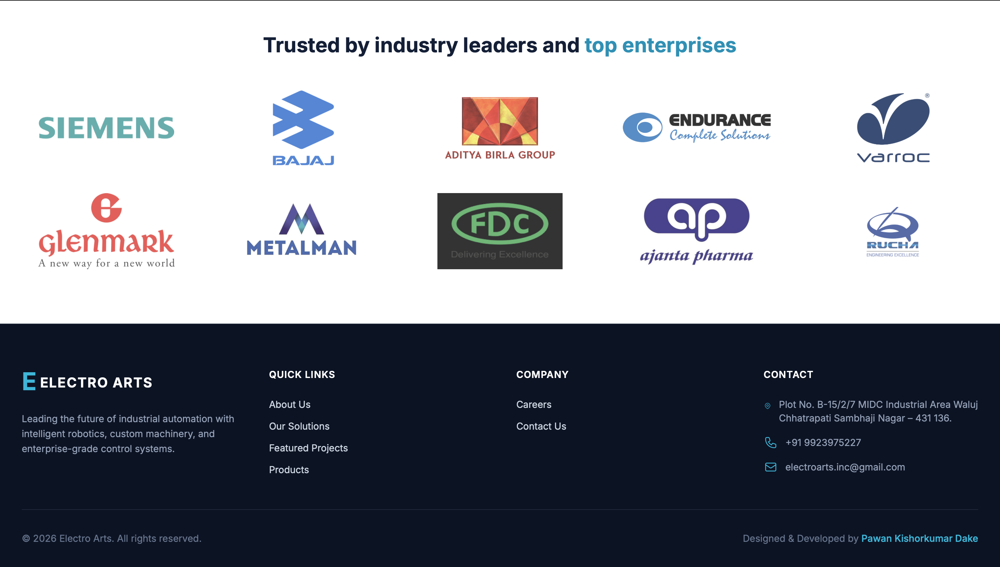
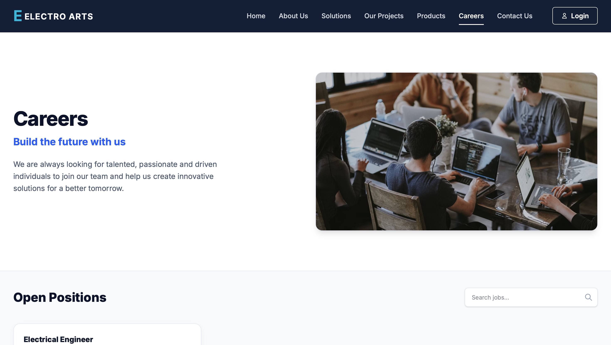
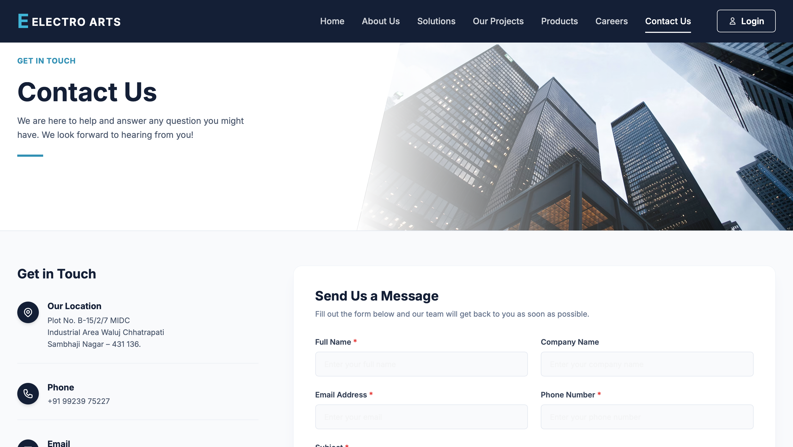

<div align="center">

# ⚡ Electro Arts Frontend

A modern and responsive frontend for the **Electro Arts** industrial automation platform, built with **Next.js** and **TypeScript**.

[](https://electro-arts.vercel.app/)

</div>

---

## 📌 Overview

The Electro Arts Frontend is designed to provide a fast, modern, and user-friendly experience for customers, employees, and administrators. It features responsive layouts, optimized performance, and a clean interface for exploring company information, products, careers, and services.

---

## ✨ Key Features

- 🏢 Company Information Pages
- 📦 Products & Solutions Showcase
- 💼 Careers & Job Vacancies
- 👨‍💼 Admin Dashboard
- 👷 Employee Portal
- 🧑‍💼 Manager Dashboard
- 🛎️ Reception Module
- 🔐 Secure Login System
- 📱 Fully Responsive Design
- ⚡ Fast Performance with Next.js

---

## 🛠️ Tech Stack

| Category | Technology |
|----------|------------|
| Framework | Next.js |
| Language | TypeScript |
| Styling | Tailwind CSS |
| UI | shadcn/ui |
| Icons | Lucide React |
| Animations | Framer Motion |
| Deployment | Vercel |

---

# 📸 Screenshots

### 🏠 Home Page

<p align="center">

</p>

---

### 🏢 About Page

<p align="center">

</p>

---

### 💼 Careers

<p align="center">

</p>

---

### 📞 Contact Page

<p align="center">

</p>

---
## 📂 Project Structure

```text
electro-arts-frontend/
│
├── app/
│   ├── about-us/
│   ├── admin/
│   ├── careers/
│   ├── contact/
│   ├── employee/
│   ├── login/
│   ├── manager/
│   ├── products/
│   ├── projects/
│   ├── reception/
│   ├── solutions/
│   ├── globals.css
│   ├── layout.tsx
│   └── page.tsx
│
├── components/
├── public/
│
├── .env.local
├── .gitignore
├── package.json
├── tsconfig.json
├── postcss.config.mjs
└── next.config.ts
```

---

## ⚙️ Installation

```bash
git clone https://github.com/pawandake14/electro-arts-frontend.git

cd electro-arts-frontend

npm install

npm run dev
```

---

## 🌐 Live Website

👉 **https://electro-arts.vercel.app/**

---

## 👨‍💻 Author

**Pawan Kishorkumar Dake**

Full Stack Developer

GitHub: https://github.com/pawandake14

---

<div align="center">

⭐ If you like this project, consider giving it a star!

</div>
